# 🏪 LocalMart - Cloud-Native E-commerce Microservices Platform

[](https://opensource.org/licenses/MIT)
[](https://www.docker.com/)
[](https://microservices.io/)

LocalMart is a **comprehensive cloud-native e-commerce microservices application** designed as a hands-on learning environment for modern engineers. Built around a relatable e-commerce domain, it demonstrates real-world patterns for containerized service management, observability, and production-ready development practices.

## 🎯 Educational Purpose

This repository serves as a **complete learning platform** for understanding the modern software delivery lifecycle. It's specifically designed for creating teaching videos and hands-on learning experiences that bridge the gap between development and operations.

### Why LocalMart?
- **Familiar Domain**: E-commerce concepts everyone understands (products, shopping carts, orders)
- **Real-world Complexity**: Realistic service interactions and business logic
- **Production Patterns**: Demonstrates actual patterns used in enterprise systems
- **Cross-functional Skills**: Breaks down traditional dev/ops silos

## 🏗️ Architecture Overview

```mermaid
graph TB
    %% External Layer
    User[👤 User/Browser]
    LoadBalancer[🔄 Load Balancer/Nginx]
    
    %% Frontend Layer
    Frontend[🌐 Frontend Service<br/>React + TypeScript<br/>Port: 3000]
    
    %% API Gateway/Proxy Layer
    Nginx[🚪 Nginx Proxy<br/>Route Management]
    
    %% Microservices Layer
    Users[👥 Users Service<br/>Python FastAPI<br/>Port: 8081]
    Cart[🛒 Cart Service<br/>Node.js Express<br/>Port: 8082]
    Catalog[📦 Catalog Service<br/>Go Gin<br/>Port: 8080]
    
    %% Data Layer
    PostgresUsers[(🗄️ PostgreSQL<br/>Users DB<br/>Port: 5433)]
    PostgresCatalog[(🗄️ PostgreSQL<br/>Catalog & Orders DB<br/>Port: 5432)]
    Redis[(🔴 Redis<br/>Cart Sessions<br/>Port: 6379)]
    
    %% External Services (Future)
    Monitoring[📊 Observability<br/>Tracing, Metrics, Logs]
    
    %% User interactions
    User --> LoadBalancer
    LoadBalancer --> Frontend
    
    %% Frontend to services
    Frontend --> Nginx
    Nginx --> Users
    Nginx --> Cart
    Nginx --> Catalog
    
    %% Service interactions
    Cart --> Catalog
    Cart --> Users
    
    %% Data connections
    Users --> PostgresUsers
    Catalog --> PostgresCatalog
    Cart --> PostgresCatalog
    Cart --> Redis
    
    %% Observability
    Users -.-> Monitoring
    Cart -.-> Monitoring
    Catalog -.-> Monitoring
    Frontend -.-> Monitoring
    
    %% Styling
    classDef frontend fill:#e1f5fe,stroke:#01579b,stroke-width:2px
    classDef microservice fill:#f3e5f5,stroke:#4a148c,stroke-width:2px
    classDef database fill:#fff3e0,stroke:#e65100,stroke-width:2px
    classDef infrastructure fill:#e8f5e8,stroke:#2e7d32,stroke-width:2px
    classDef external fill:#fce4ec,stroke:#c2185b,stroke-width:2px
    
    class Frontend frontend
    class Users,Cart,Catalog microservice
    class PostgresUsers,PostgresCatalog,Redis database
    class LoadBalancer,Nginx infrastructure
    class User,Monitoring external
```



## 🛠️ Technology Stack

### Frontend
- **React 18** with TypeScript
- **Tailwind CSS v4** for styling
- **React Router** for SPA navigation
- **React Query** for state management
- **Vite** for build tooling

### Microservices
| Service | Language | Framework | Purpose |
|---------|----------|-----------|---------|
| **Users** | Python | FastAPI | Authentication, user management |
| **Cart** | Node.js | Express | Shopping cart, checkout, orders |
| **Catalog** | Go | Gin | Product catalog, inventory |

### Infrastructure
- **PostgreSQL** - Primary database for users, products, and orders
- **Redis** - Session storage for shopping carts
- **Docker Compose** - Local development orchestration
- **Nginx** - API routing and static file serving

### Observability (Built-in)
- **OpenTelemetry** tracing across all services
- **Prometheus** metrics collection
- **Structured JSON** logging with correlation IDs
- **Frontend RUM** metrics collection

## 🚀 Quick Start

### Prerequisites
- Docker & Docker Compose
- Node.js 18+ (for local development)
- Go 1.21+ (for catalog service development)
- Python 3.11+ (for users service development)

### 1. Clone and Start
```bash
git clone <repository-url>
cd LocalMart
docker-compose up -d
```

### 2. Access the Application
- **Frontend**: http://localhost:3000
- **Users API**: http://localhost:8081
- **Cart API**: http://localhost:8082
- **Catalog API**: http://localhost:8080

### 3. Test the Complete Flow
1. **Browse Products** - View the product catalog
2. **Sign Up/Login** - Create an account or login
3. **Add to Cart** - Add products to your shopping cart
4. **Checkout** - Complete an order with shipping details
5. **View Orders** - Check your order history

## 📋 API Endpoints

### Users Service (Python FastAPI)
```
POST   /api/users/v1/auth/signup      # Create account
POST   /api/users/v1/auth/login       # User authentication
GET    /api/users/v1/users/me         # Get current user
PUT    /api/users/v1/users/me         # Update profile
GET    /api/users/v1/health           # Health check
```

### Cart Service (Node.js Express)
```
GET    /api/cart/v1/cart              # Get user's cart
POST   /api/cart/v1/cart/items        # Add item to cart
PUT    /api/cart/v1/cart/items/:id    # Update item quantity
DELETE /api/cart/v1/cart/items/:id    # Remove item
DELETE /api/cart/v1/cart              # Clear cart
POST   /api/cart/v1/cart/checkout     # Process checkout
GET    /api/cart/v1/orders            # Get order history
GET    /api/cart/v1/orders/:id        # Get order details
```

### Catalog Service (Go Gin)
```
GET    /api/catalog/v1/products       # List products (paginated)
GET    /api/catalog/v1/products/:id   # Get product details
GET    /api/catalog/v1/products/analyze # Complex analysis (tracing demo)
GET    /api/catalog/v1/health         # Health check
POST   /api/v1/frontend-metrics       # Frontend metrics collection
```


## 💻 Development

### Running Individual Services

#### Frontend Development
```bash
cd services/frontend
npm install
npm run dev
# Runs on http://localhost:5173
```

#### Cart Service Development
```bash
cd services/cart
npm install
npm run dev
# Requires Redis and PostgreSQL
```

#### Catalog Service Development
```bash
cd services/catalog
go mod tidy
go run main.go
# Requires PostgreSQL
```

#### Users Service Development
```bash
cd services/users
pip install -r requirements.txt
uvicorn app.main:app --reload --port 8081
# Requires PostgreSQL
```

### Testing

#### Generate Realistic Traffic
```bash
# Simulate e-commerce traffic patterns
./scripts/simulate-traffic.sh

# Custom duration and interval
./scripts/simulate-traffic.sh --duration 300 --interval 2

# Seed database only
./scripts/simulate-traffic.sh --seed-only
```

#### Manual API Testing
```bash
# Health checks
curl http://localhost:8080/health
curl http://localhost:8081/health
curl http://localhost:8082/health

# Test complete checkout flow
# 1. Create account
# 2. Add items to cart
# 3. Process checkout
# 4. View order history
```

## 🔄 Service Interactions

### User Registration & Login Flow


### Shopping & Checkout Flow


## 📊 Observability Features

### Built-in Monitoring
- **Distributed Tracing**: Full request tracing across all services
- **Custom Metrics**: Business and technical metrics collection
- **Structured Logging**: Correlation IDs for request tracking
- **Frontend Metrics**: Real User Monitoring (RUM) data collection

### Example Trace Flow
```
HTTP Request → Frontend → Nginx → Cart Service → Catalog Service → Database
     ↓              ↓         ↓         ↓             ↓             ↓
   Browser     React Query  Proxy   Express.js    Gin HTTP    PostgreSQL
   Metrics     Tracking    Routing   Business     Product      Data Layer
                                     Logic      Validation
```

## 🚢 Deployment

### Docker Compose (Development)
```bash
# Start all services
docker-compose up -d

# View logs
docker-compose logs -f

# Stop and clean up
docker-compose down -v
```

### Environment Configuration
Key environment variables:
```bash
# Database
POSTGRES_DB=localmart
POSTGRES_USER=catalog_user
POSTGRES_PASSWORD=catalog_password

# Authentication
USERS_JWT_SECRET_KEY=your-secret-key

# Services
CATALOG_PORT=8080
CART_PORT=8082
USERS_PORT=8081
FRONTEND_PORT=3000

# Observability
TRACING_ENABLED=false
OTEL_EXPORTER_OTLP_ENDPOINT=
```

## 🤝 Contributing

This project is designed for educational purposes. Contributions that enhance the learning experience are welcome:

1. **Bug Fixes**: Improve reliability and user experience
2. **Documentation**: Better explanations and examples
3. **New Features**: Additional microservices or functionality
4. **Observability**: Enhanced monitoring and debugging capabilities

## 📚 Learning Resources

### Recommended Learning Path
1. **Start Here**: Run the complete application locally
2. **Explore Services**: Examine each microservice's code and patterns
3. **Trace Requests**: Use the observability features to understand data flow
4. **Modify & Extend**: Add new features or modify existing ones
5. **Deploy**: Take it to Kubernetes for production experience

### Key Concepts Demonstrated
- **Microservices Design Patterns**: Service boundaries, data ownership
- **API Design**: RESTful services, error handling, versioning
- **Database Design**: Multi-service data management
- **Authentication**: JWT tokens, session management
- **Observability**: Tracing, metrics, logging best practices
- **Development Workflow**: Docker, local development, testing

## 📄 License

